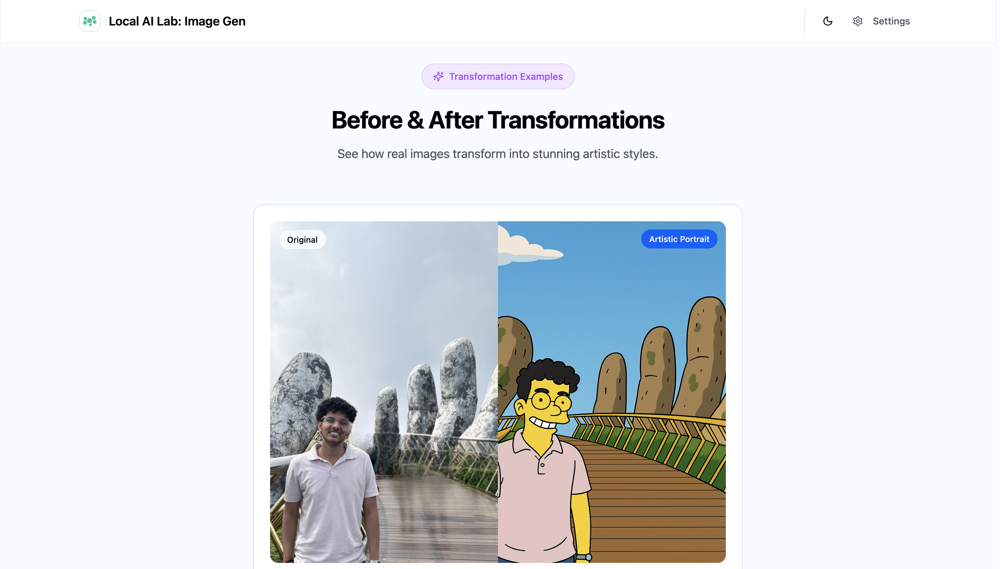

# AI Transform Studio - Privacy-First AI Image Transformation

A modern React application built with TanStack Router that transforms images using AI services while maintaining complete privacy through Bring Your Own Keys (BYOK) functionality.




## 🔑 Key Features

### **Bring Your Own Keys (BYOK)**
- **Complete Privacy**: Your images and API keys never leave your device
- **Your Own Keys**: Use your own OpenAI, Gemini, or other AI service accounts
- **No Data Storage**: We don't store, analyze, or train on your images
- **Full Control**: You control costs, usage, and data handling

### **Modern Architecture**
- **React 18+** - Latest React features with concurrent rendering
- **TanStack Router** - Type-safe routing with built-in caching and URL state management
- **TypeScript** - Full type safety throughout the application
- **Modern CSS** - Dark/light theme with glass morphism effects
- **Responsive Design** - Mobile-first UI that works on all devices

### **AI Transformation Styles**
- Artistic Portrait
- Digital Art
- Oil Painting
- Watercolor
- Pencil Sketch
- Pop Art
- Abstract Style

## 🚀 Quick Start

### Prerequisites
- Node.js 18+ 
- npm, yarn, or pnpm
- API key from OpenAI or Google Gemini

### Installation

1. **Clone the repository**
   ```bash
   git clone https://github.com/your-username/ai-transform-studio.git
   cd ai-transform-studio
   ```

2. **Install dependencies**
   ```bash
   npm install
   # or
   yarn install
   # or
   pnpm install
   ```

3. **Start the development server**
   ```bash
   npm run dev
   # or
   yarn dev
   # or
   pnpm dev
   ```

4. **Configure your API keys**
   - Open the application in your browser
   - Click the "Settings" button in the navigation
   - Select your preferred AI provider (OpenAI or Gemini)
   - Enter your API key
   - Save the configuration

## 🔧 Configuration

### Getting API Keys

#### OpenAI
1. Visit [OpenAI Platform](https://platform.openai.com/api-keys)
2. Create a new API key
3. Copy the key (starts with `sk-`)

#### Google Gemini
1. Visit [Google AI Studio](https://aistudio.google.com/app/apikey)
2. Create a new API key
3. Copy the key (starts with `AIza`)

### Supported Models

#### OpenAI
- GPT Image 1
- DALL-E 3
- DALL-E 2

#### Google Gemini
- Gemini 2.0 Flash (Image Generation)

## 🏗️ Tech Stack

- **Frontend Framework**: React 18+
- **Routing**: TanStack Router (type-safe routing)
- **Styling**: Tailwind CSS with custom design system
- **UI Components**: Radix UI primitives
- **Icons**: Lucide React
- **Build Tool**: Vite
- **Language**: TypeScript
- **Package Manager**: npm/yarn/pnpm

## 🔐 Privacy & Security

### Local Storage Only
- API keys are stored locally in your browser's localStorage
- No data is transmitted to our servers
- All image processing happens directly between your browser and your chosen AI provider

### No Tracking
- No analytics or tracking scripts
- No user data collection
- No usage monitoring

### Open Source
- Complete transparency through open source code
- Audit the code yourself
- Community-driven development

## 📁 Project Structure

```
src/
├── components/          # React components
│   ├── ui/             # Base UI components (buttons, inputs, etc.)
│   ├── cartoon-hero.tsx # Main transformation component
│   └── settings-dialog.tsx # API key configuration
├── config/             # Application configuration
│   └── app-config.ts   # Centralized app constants
├── lib/                # Utility libraries
│   ├── ai-service.ts   # AI provider integrations
│   ├── settings-context.tsx # Settings state management
│   └── utils.ts        # Helper functions
├── routes/             # TanStack Router routes
│   ├── __root.tsx      # Root layout component
│   └── index.tsx       # Home page route
└── styles/             # Global styles and themes
```

## 🎨 Customization

### Branding
Update the app configuration in `src/config/app-config.ts`:

```typescript
export const APP_CONFIG = {
  APP_NAME: "Your App Name",
  TAGLINE: "Your tagline",
  MAIN_HEADING: "Your main heading",
  // ... other configuration
}
```

### Styling
The application uses a modern design system with:
- CSS custom properties for theming
- Dark/light mode support
- Glass morphism effects
- Responsive breakpoints

### Adding New AI Providers
1. Extend the AI service in `src/lib/ai-service.ts`
2. Update the settings interface in `src/lib/settings-context.tsx`
3. Add provider options in the settings dialog

## 🚀 Deployment

### Vercel (Recommended)
```bash
npm run build
vercel --prod
```

### Netlify
```bash
npm run build
# Deploy the dist/ folder
```

### Docker
```dockerfile
FROM node:18-alpine
WORKDIR /app
COPY package*.json ./
RUN npm install
COPY . .
RUN npm run build
EXPOSE 3000
CMD ["npm", "run", "preview"]
```

## 🤝 Contributing

We welcome contributions! Please see our [Contributing Guide](CONTRIBUTING.md) for details.

### Development Setup
1. Fork the repository
2. Create a feature branch
3. Make your changes
4. Add tests if applicable
5. Submit a pull request

### Code Style
- Use TypeScript for all new code
- Follow the existing code style
- Use meaningful component and variable names
- Add JSDoc comments for complex functions

## 📄 License

This project is licensed under the MIT License - see the [LICENSE](LICENSE) file for details.

## 🙏 Acknowledgments

- [TanStack Router](https://tanstack.com/router) for type-safe routing
- [Radix UI](https://radix-ui.com/) for accessible UI primitives
- [Tailwind CSS](https://tailwindcss.com/) for utility-first styling
- [Lucide](https://lucide.dev/) for beautiful icons

## 📞 Support

- 📧 Email: support@aitransformstudio.com
- 💬 Discord: [Join our community](https://discord.gg/aitransformstudio)
- 🐛 Issues: [GitHub Issues](https://github.com/your-username/ai-transform-studio/issues)

---

**Built with ❤️ for privacy-conscious creators**
